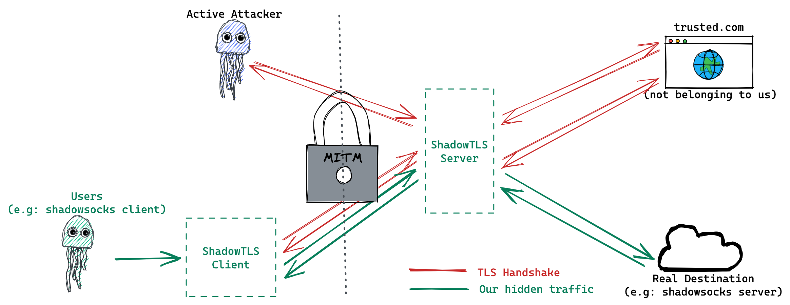

# 协议

ShadowTLS 协议有两个版本。

第一个版本是一个简单的协议，只能将真正的 TLS 握手暴露给中间人，但不能防御主动检测，而且 TLS 握手后的流量也很容易区分。

第二个版本比较复杂，但是可以防御主动检测，tls握手后的流量很难区分。如果攻击者使用浏览器访问服务端，它能将像真正的 Web 服务器一样工作。

## V1
在这个版本中，我们只想让中间人观测到 TLS 握手，并且握手使用其他人的合法证书。这是我们最初的目标。

中间人将看到有效的受信任证书的握手流量。如果假设中间人不会主动探测，并且不会分析在 TLS 握手完成后的流量，这个版本可以用来防御：
1. 基于流量特征的封锁：我们看起来像正常的 TLS 流量，而不是 shadowsocks 那样的无法理解的随机数据。
2. 基于 SNI 的封锁：我们使用合法且受信任的证书（比如可能某些大型公司或政府机构的域名是被标记为受信任的），因此会被认为是合法数据。

V1 版本的最后一个实现是 [v0.1.4](https://github.com/ihciah/shadow-tls/releases/tag/v0.1.4).

### 客户端
客户端连接服务器并进行 TLS 握手。握手后，所有客户端流量将不加修改地发送到服务器（包括加密和数据封装等）。

1. 与 example.trusted-server.domain 进行 TLS 握手。
2. 中继流量（不加修改）。

但是，TLS 握手后的实际流量是带有 Application Data 封装的数据包，所以流量很容易区分。

现在流量看起来像是与受信任服务器的 TLS 连接（因为我们可以使用受信任的域和证书），但实际上它不是 http 服务，而使用 TLS 但不使用 http 的服务器非常少，这可能也会是一个特征。

### 服务端
服务器在客户端和 2 个后端之间中继数据。一个后端是 TLS 握手服务器，它提供有效的证书（不属于我们）；另一个后端是我们的数据服务器。握手完成后，服务器将在客户端和数据服务器之间中继流量。

1. 接受连接。
2. 在客户端和 TLS 握手服务器之间中继流量（例如 example.trusted-server.domain:443）。它还将监视流量以查看握手是否完成。
3. 握手完成后在客户端和我们的真实服务器之间中继流量。

由于我们需要感知握手结束，所以这个版本我们只能使用 TLS1.2。

## V2
该版本旨在解决流量分析和主动检测问题。此外，它可以支持 TLS 1.3。

### 客户端
客户端连接服务器并进行 TLS 握手。 握手后：
1. 所有数据都将打包在 TLS Application Data 中。
2. 在第一个 Application Data 包的数据的最前面插入一个 8 字节的 hmac。

hmac 是使用服务器发送的所有数据计算的（服务器发送的所有数据被用作 challenge，因为客户端无法完全控制它，并且有一定随机性）。hmac 可以被视为对 challenge 的响应，用于识别。

### 服务端
服务器在客户端和 2 个后端（模式和 V1 一样）之间中继数据。 不同的是：我们不会观察流量来查看握手是否完成；相反，我们使用 hmac。所以我们更容易解析流量和切换后端。此外，还支持 TLS1.3 或其他版本。

1. 接受连接。
2. 在客户端和 tls 握手服务器之间中继流量（例如 example.trusted-server.domain:443）。服务器发送的所有数据将用于计算 hmac。如果客户端发送的某个 Application Data 包的前缀有有效的hmac，我们会将流量切换到我们的数据服务器。
3. 如果不切换，流量将被中继到 TLS 握手服务器。使用浏览器访问服务器的用户将能够访问握手服务器上的 http 服务。为了效率，我们只能对前 N 个数据包进行 hmac 检查（在我们的实现中 N = 3，hmac 算法为 HMAC-SHA1）。
